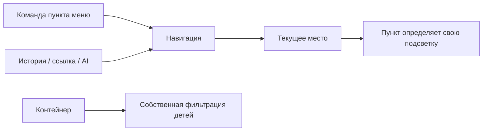

# MiraiSpace: предложения для второго обсуждения

6 сентября 2026. Это проект решений для обсуждения. Примеры ниже показывают возможную форму API; они не являются реализованными или уже согласованными контрактами.

Главное предложение: модуль предоставляет возможности приложения, меню представляет выбранные возможности пользователю, навигация открывает страницы, а будущие AI-команды вызывают прикладные операции. Эти части взаимодействуют, сохраняя собственные обязанности.

## Что уже зафиксировано

- В `View` допускается только необходимая UI-адаптация. Событие контрола передаёт входные данные команде ViewModel; решение открыть страницу или диалог принадлежит команде/сервису. Предпочтительны bindings и Behaviors от wieslawsoltes.
- Общий обработчик исключений ReactiveUI настраивается при запуске. Одинаковые `try/catch` и подписки на `ThrownExceptions` у каждой команды не нужны. Локальная обработка нужна только для конкретного восстановления после ошибки.
- Используем `ILogger<T>` и стандартную интеграцию логирования; Serilog выбран как основной вариант. Сохраняем подход с Generic Host и существующей интеграцией Avalonia.
- `ReactiveModel` — преимущественно INPC и минимум логики; `ReactiveComponent` — составная часть страницы; `ReactivePage` — верхний уровень.
- Имя интерфейса инициализации — `IInitializable`. Сигнатуры и правила жизненного цикла ещё обсуждаем.
- Для сообщений выбран MessagePipe. Диалоги обсуждаем после навигации; URL у диалогов не будет.
- **Каждый контейнер меню сам владеет фильтрацией своих детей. Одинаковый код фильтрации не является основанием переносить эту ответственность в общий сервис.**

## 1. Меню: что стоит сохранить и что улучшить

Минимальный контракт подходит для расширяемого приложения:

```csharp
public interface IAppMenuItem
{
    ICommand ExecuteCommand { get; }
}
```

Он позволяет создать обычный пункт, счётчик входящих, переключатель, выбор рабочего пространства или пункт с собственным содержимым. Конкретный ViewModel задаёт необходимые свойства, команда определяет действие, а точная регистрация `IViewFor<T>` определяет представление.

Предлагаю сохранить keyed DI, самостоятельные ViewModel пунктов, собственные View и локальные коллекции контейнеров. Не добавлять обязательные `Title`, `Icon`, `Url`, `ParentId` и универсальный descriptor для всех пунктов. `StandardAppMenuItem` может оставаться удобной необязательной базой для обычного оформления.

Улучшения, которые решают конкретные задачи:

| Предложение | Польза | Граница |
| --- | --- | --- |
| Контейнер получает вклад других модулей через свой DI-ключ | Плагин добавляет пункт в существующую группу | Контейнер продолжает сам решать, какие дети видимы и в каком виде |
| Ключи расширений принадлежат самому расширению | Новая группа плагина не требует правок основного приложения | Основные ключи остаются в `AppMenuKeys`; для ключей плагина обсуждаем собственный класс констант с префиксом plugin ID |
| У обычного пункта есть необязательный помощник для определения активного места | Корректная подсветка при Back, прямой ссылке и переходе из AI | Не распространять маршрутное поведение на действия, переключатели и контейнеры |
| Состояние выполнения принадлежит команде пункта | Показ загрузки и блокировка повторного действия | Не вводить второй независимый флаг `CanExecute` в отдельном реестре |
| Стабильный ID вводится там, где действительно нужны закрепление и персональный порядок | Настройки переживают перезапуск и обновление плагина | Локализованный заголовок и имя CLR-типа для этого не подходят; пока ID не обязателен для всего меню |
| Обычные пункты используют общие ресурсы оформления | Плагины выглядят частью приложения | Пользовательский View сохраняет возможность показать особое содержимое |

Сегодня корневое меню и `WorkspaceMenuItemContainer` действительно повторяют части DynamicData pipeline. После уточнения пользователя **вынос этого кода не предлагается**. Проверять следует конкретные свойства поведения: корректность повторной активации, освобождение принадлежащих контейнеру ресурсов и сохранение динамических детей. Это не требует единой политики фильтрации.

### Меню и навигация: связь в обе стороны, разные обязанности

У пункта есть намерение пользователя: «открыть отчёт», «создать страницу», «раскрыть группу». Навигация знает результат перехода: какая страница открылась, в каком рабочем пространстве и с какими параметрами. После успешного перехода пункт может обновить собственное визуальное состояние.



Стрелки обозначают вызов или наблюдение состояния, а не обязательную зависимость всех типов от всех остальных.

| Сценарий | Предлагаемое поведение |
| --- | --- |
| Нажали «Создать страницу» | Команда выполняет операцию; сам пункт не обязан становиться выделенным |
| Раскрыли Workspace | Меняется состояние контейнера; навигация не происходит |
| Открыли `/workspace/pages/42` по ссылке | Страница открывается без поиска соответствующего объекта в меню; пункт «Страницы» может обозначать активный раздел |
| Переход из меню отклонён защитой несохранённых изменений | Подсветка остаётся у фактически открытой страницы |
| Один документ есть в разделе и в избранном | Обсуждаем, обозначают ли оба пункта открытый документ или один показывает основной выбор, а другой — факт открытия |
| Контейнер отфильтровал пункт | Это не обязано закрывать открытую страницу: скрытие пункта и отзыв права доступа — разные события |
| У пользователя отозвали право на страницу | Доступ проверяется на границе операции/навигации независимо от наличия пункта в меню |

Здесь я не предлагаю подчинять структуру меню таблице маршрутов. Также не предлагаю строить весь роутер обходом меню: страницы документов, скрытые служебные страницы и прямые ссылки должны работать без видимого пункта. Самостоятельный модуль связывает нужные ему пункты, страницы и операции.

### Улучшения внешнего вида

Предлагаю развить уже выбранное направление: спокойная рабочая область, компактная навигация слева и быстрый поиск по `Ctrl+K`.

- Разделить в поиске переходы и действия: у «Открыть календарь» и «Создать страницу» разные последствия. В результате показывать короткое описание и сочетание клавиш, если оно есть.
- Поддержать в компактном меню раскрытие контейнера в flyout с названием группы, собственными детьми и доступным управлением с клавиатуры.
- Дать активному месту один основной акцент; счётчики и состояния соединения должны оставаться различимыми без набора конкурирующих цветов.
- «Избранное» и «Недавние» рассматривать как самостоятельные контейнеры со своими источниками и фильтрацией. Их не нужно добавлять в первый этап, пока не выбран способ идентификации закрепляемых объектов.
- Контекстные действия пункта — например, закрепить или открыть в новой вкладке — показывать только когда соответствующее действие поддерживается.
- Сохранять осмысленную плотность: вторую строку добавлять, когда она помогает выбрать назначение, а не каждому пункту по шаблону.

Поиск с быстрыми действиями и предварительным просмотром есть у [Flow Launcher](https://github.com/Flow-Launcher/Flow.Launcher). Для MiraiSpace это визуальный и сценарный ориентир; [CodeWF.Toolbox](https://github.com/dotnet9/CodeWF.Toolbox) — дополнительный пример модульного инструментария на Avalonia.

## 2. Навигация и инициализация

У [MPowerKit.Navigation](https://github.com/MPowerKit/Navigation) полезно изучить разделение инициализации, уведомлений о переходе, жизненного цикла страницы и регионов. Его MAUI-правила не следует автоматически переносить в Avalonia. Например, их одноразовая инициализация синхронная; это не решает нашу задачу асинхронной загрузки страницы.

Предлагаемый пользовательский API:

```csharp
await navigation.NavigateAsync("/workspace/pages/42?tab=history");

await navigation.NavigateAsync(
    WorkspaceRoutes.Page,
    new PageParameters(pageId, PageTab.History));

await navigation.BackAsync();
```

Это два входа в один механизм: строка удобна для ссылок и командной строки, типизированный вызов — для кода модулей. Параметры, попадающие в URL, должны иметь определённое преобразование туда и обратно. Произвольный объект, переданный в памяти, не обещает восстановление из ссылки.

Маршрут описывает место. Отдельный идентификатор экземпляра понадобится только если разрешаем несколько одновременно открытых страниц с одинаковым адресом. Номер вкладки, DI scope и регион диалога в URL не кодируем.

Черновик инициализации:

```csharp
public interface IInitializable
{
    ValueTask InitializeAsync(CancellationToken cancellationToken = default);
}

public interface IInitializable<in TParameters>
{
    ValueTask InitializeAsync(
        TParameters parameters,
        CancellationToken cancellationToken = default);
}
```

Название интерфейса уже согласовано, остальное — предложение. Суффикс `Async` у метода предлагаю сохранить как привычную .NET-конвенцию. `IInitializable<TParameters>` фиксирует тип входа конкретного компонента; метод `Initialize<T>(T parameters)` позволял бы передать ему произвольный тип. Включать оба интерфейса в каждый базовый класс не нужно.

Моя исходная рекомендация: инициализация один раз на успешно созданный экземпляр; возвращение на сохранённый экземпляр не запускает её заново. Обновление данных — отдельное осмысленное действие. Владелец страницы управляет созданием и освобождением компонентов; компоновщик не должен обходить все объекты DI и искать у них `IInitializable`.

Переход должен иметь ясную границу применения: найти маршрут, проверить допустимость ухода и доступа, создать/подготовить новую страницу, затем изменить текущее место и историю. При сбое подготовки уже открытая страница остаётся доступной. Если нужна долгая загрузка, отдельно решаем, показывать ли новую страницу с её состоянием загрузки раньше завершения загрузки данных.

Ожидаемые исходы — неизвестный адрес, запрет доступа, отказ покинуть страницу — удобно возвращать как результат. Неожиданные ошибки реализации должны доходить до общего обработчика; в UI это механизм ReactiveCommand. Правила отмены и конкурирующих переходов нужно зафиксировать отдельно, без пустых catches в пунктах меню.

## 3. Плагины: сначала модель расширения

Предлагаю для первой версии доверенные .NET-плагины, загружаемые при запуске. Установку или отключение применять при следующем запуске. Возможность горячей выгрузки UI-плагинов стоит обсуждать отдельным требованием: .NET выгружает AssemblyLoadContext кооперативно, и живые ссылки/подписки могут удерживать сборки. [Документация .NET](https://learn.microsoft.com/en-us/dotnet/standard/assembly/unloadability).

Сохранить общий вход встроенного модуля и плагина:

```csharp
public interface IAppModule
{
    void ConfigureServices(IServiceCollection services);
}
```

Модуль может добавлять сервисы, страницы и типизированные операции; UI-модуль — пункты меню, View и ресурсы. Это возможности, а не список обязательных интерфейсов, которые реализует каждый плагин.

Пример независимого вклада UI-модуля, где `AddPage` — лишь предлагаемый helper:

```csharp
services.AddKeyedScoped<IAppMenuItem, ReportsMenuItem>(AppMenuKeys.Root);
services.AddKeyedScoped<IAppMenuItem, RecentReportsMenuItem>(ReportsMenuKeys.Children);

services.AddPage<ReportPage, ReportParameters>(ReportsRoutes.Report);
services.AddScoped<IViewFor<ReportPage>, ReportView>();
```

Регистрации пункта и страницы соседствуют, но не требуют обязательного соответствия один к одному. Создание новой группы определяется ключом и самим контейнером, без центрального дерева `ParentId`.

Перед реализацией загрузчика предлагаю согласовать:

| Область | Предложение |
| --- | --- |
| Идентичность | Стабильный plugin ID, версия пакета, диапазон версии контракта, явная точка входа |
| Зависимости | Явно объявленные обязательные зависимости; порядок по зависимостям и стабильный ID для разрешения равенства |
| Конфликты | Совпадение route ID/пути или plugin ID — диагностируемая ошибка; замена View/сервиса допустима по явно выбранной политике расширения |
| Регистрация | До построения корневого provider; `ConfigureServices` описывает граф и не запускает соединения или фоновые задачи |
| Ошибки | Обязательный модуль останавливает запуск; необязательный пропускается вместе с зависимыми от него модулями, причина сохраняется |
| Откат | Можно отбросить неподтверждённые регистрации; нельзя обещать откат произвольных побочных действий, уже выполненных кодом плагина |
| Сборки | Единая версия общих контрактов; отдельная политика для частных зависимостей. DI-контейнер не заменяет загрузчик сборок |
| Ресурсы UI | Уникальные имена ресурсов плагина и явная последовательность подключения стилей; не менять глобальную тему случайным порядком загрузки |
| Состояние | Метаданные плагина отделены от экземпляров его меню/страниц. ViewModel не становятся singleton только потому, что пришли из плагина |

Начать стоит с одного внешнего образца: он добавляет контейнер, дочерний пункт, страницу с параметром и свою View без редактирования ядра. Такой сценарий быстрее обнаружит проблемы контракта, чем большой SDK с пока неиспользуемыми точками расширения. Проверки и тесты этого сценария добавляем только после отдельного разрешения пользователя на тесты.

### Где полезен Autofac

Autofac интересен, если нам нужны сессия → рабочее пространство/окно → страница и общие сервисы, принадлежащие конкретному уровню. Он поддерживает вложенные и помеченные lifetime scopes, а также интеграцию с Generic Host и `IServiceCollection`. [Lifetime scopes](https://autofac.readthedocs.io/en/latest/lifetime/working-with-scopes.html), [интеграция](https://autofac.readthedocs.io/en/latest/integration/netcore.html).

Я бы выбирал его после ответа о времени жизни страниц. Наличие плагинов само по себе недостаточно. Если выберем Autofac, нужно явно договориться о регистрации сервисов сессии и страницы: простая замена provider не превращает все `AddScoped` в нужную прикладную модель. Публичный `IAppModule` можно сохранить, а специфичные правила контейнера сосредоточить в интеграции.

## 4. Общие команды для интерфейса и нейросети

Идея командного движка полезна уже без модели: одни операции смогут использовать поиск команд, горячие клавиши и автоматизация. В качестве ядра предлагаю типизированные прикладные действия с входом и результатом.

```text
Кнопка / пункт меню ─┐
Поиск команд ────────┼─> Прикладная операция -> типизированный результат
Текстовая команда ──┤             |
AI tool call ───────┘             └-> факт через MessagePipe
```

Например, `pages.create` получает имя и рабочее пространство, возвращает ID созданной страницы. Решение открыть страницу после создания принадлежит вызывающему сценарию. Это позволяет AI подготовить несколько страниц без неожиданной серии переключений интерфейса.

Для человека можно предусмотреть `pages create --title "План"`. AI удобнее отдавать схему параметров и получать структурированный результат. Текстовый синтаксис при этом становится одним из адаптеров. Выполнение PowerShell в процессе приложения для этого не требуется.

Операция должна уметь сообщить о доступности, отмене, ходе работы и результате. UI может обернуть её в ReactiveCommand. Исполнитель AI/CLI тоже обрабатывает ошибки на своей границе: глобальный обработчик ReactiveUI не перехватывает вызовы, сделанные вне ReactiveCommand.

Для действий с последствиями нужно заранее знать, можно ли показать предварительный результат и требуется ли подтверждение пользователя. Определять это должен контракт приложения, а не описание, придуманное моделью. Скрытый пункт меню не запрещает вызов операции — права проверяются в самой операции.

[ConsoleAppFramework](https://github.com/Cysharp/ConsoleAppFramework) рассматриваю как адаптер командной строки. Его запуск умеет управлять Host и ServiceProvider, поэтому при встраивании потребуется явно сохранить владельцем жизненного цикла Desktop-host. Для внешних плагинов также надо отдельно проверить динамическое обнаружение команд: генерация команд основного приложения при компиляции сама по себе эту задачу не решает.

Дополнительный кандидат для AI — [Microsoft.Extensions.AI](https://learn.microsoft.com/en-us/dotnet/ai/microsoft-extensions-ai): общая абстракция клиента позволит выбирать интеграцию модели отдельно от действий приложения. Пакет и поставщик пока не выбраны.

## 5. Диалоги, тема и библиотеки

У [HanumanInstitute.MvvmDialogs](https://github.com/mysteryx93/HanumanInstitute.MvvmDialogs) есть интеграция с DialogHost для overlay и с FluentAvalonia для ContentDialog. Это соответствует обсуждаемому направлению встроенных диалогов. Конкретный API отложен до выбора владельца страницы/региона.

Собственную тему предлагаю начинать как набор ресурсов MiraiSpace поверх текущей базы: палитра, отступы, типографика, плотность, состояния элементов и несколько собственных шаблонов меню. Сейчас уже есть FluentTheme, DeltaDesignTheme и проект `MiraiSpace.UI.Themes`. Сначала стоит привести их к общим ресурсам, затем оценить необходимость полной замены темы.

Тема должна одинаково работать с Eremex, обычными контролами и View плагинов. Для будущего контракта достаточно начать с небольшого набора документированных ресурсов; полноценный SDK тем пока преждевременен.

Все присланные библиотеки и их предполагаемая роль разобраны в [отдельной записке](library-review.md). Установка запрошенного генератора выполнена отдельно от архитектурной реализации.

## Вопросы, с которых предлагаю начать разговор

1. **Как выглядит рабочее пространство:** сколько страниц пользователь держит открытыми одновременно, и нужны ли два экземпляра одной страницы с разными данными?
2. **Что сохраняется при переходе назад:** только адрес, или также редактор, несохранённый ввод, фильтры и прокрутка? От этого зависит владение страницей и необходимость Autofac.
3. **Что означает выделенный пункт меню:** открытый раздел, конкретный документ или последний выбор именно в этом контейнере? Особенно важно, когда один документ виден в нескольких группах.
4. **Каким будет первый реальный плагин:** дополнительный инструмент с одной страницей, большая функциональная область или интеграция с внешней системой? Нужен один конкретный образец для проверки будущего API.
5. **Должны ли сторонние плагины менять существующие функции:** заменять View и сервисы ядра, или первоначально достаточно добавления собственных возможностей?
6. **Какие первые действия нужны AI:** поиск и открытие, создание/редактирование содержимого или управление рабочим пространством? Предлагаю выбрать 3–5 операций и на них спроектировать форму команды и результата.

Следом, когда эти ответы понятны: одноразовая инициализация и повторное открытие; загрузка страницы до или после появления UI; порядок меню и закрепление; право контейнера показывать пустую группу; необходимость горячей выгрузки; степень самостоятельности собственной темы.

## Предлагаемая последовательность после согласования

1. Зафиксировать навигационные сценарии, владение экземплярами и минимальные сигнатуры.
2. Исправить экспериментальную реализацию под согласованные правила: hosting, ошибки команд, обязанности View и MessagePipe.
3. Реализовать один вертикальный сценарий меню → переход → страница → возврат, затем выполнить согласованную проверку.
4. Провести тот же сценарий через внешний модуль и уточнить plugin API.
5. Спроектировать диалоги с выбранным владельцем и встроенным host.
6. Добавить один типизированный вызов операции из поиска команд; AI подключать к уже понятному контракту.
7. Отдельно завершить CI/CD: сборки Desktop и артефакты на PR, выпуск по тегу. Автопубликация релиза и запуск тестов требуют согласования соответствующего этапа.

Регистрация репозитория как проекта в Codex Desktop остаётся отдельным незавершённым пунктом исходной задачи. Issue #10 не закрыта, реализации в рабочем дереве пока не следует считать окончательной архитектурой.
